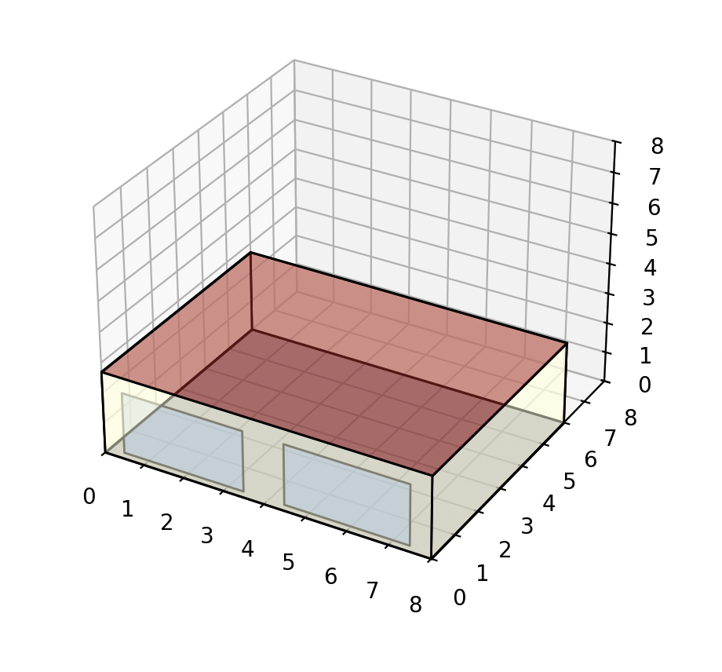

# EnergyPlus BESTEST Case 600 Validation

This repo contains two separate analysis tools for BESTEST Case 600:

1. **Standard BESTEST validation** - Compare EnergyPlus results against reference data from 7 different simulation tools
2. **EnergyPlus parameter sensitivity** - See which simulation settings actually matter

## What's inside

- `idf_files/` - EnergyPlus input files for Case 600 and Case 600FF
- `weather_files/` - BESTEST weather data
- `results/` - Reference data from other tools and your simulation results
- `parametric/` - Parameter sensitivity study tools

## BESTEST Validation (main purpose)

This validates that EnergyPlus gives reasonable results compared to other established tools.

**Run basic simulations:**
```bash
python run_simulation.py
```

**Extract and format results:**
```bash
python extract_results.py
```

**Compare against reference:**
```bash
python analyze.py
```

This creates charts showing where your EnergyPlus results sit within the acceptable range defined by BSIMAC, CSE, DeST, ESP-r, NewHASP, and TRNSYS.

**Visualize results:**
```bash
python view.py
```

This displays the validation charts and analysis plots for easy viewing.



Expected results:
- Annual heating: ~4.3 MWh (range 4.0-4.5 MWh)
- Annual cooling: ~6.3 MWh (range 5.7-6.6 MWh)

## Parameter Study (bonus analysis)

Want to know which EnergyPlus settings actually matter? 

**Run parameter sweep:**
```bash
python parametric_analysis.py run_full
```

This tests 30+ variants changing timesteps, convection algorithms, shadow calculations, etc.

**Key findings:**
- **Matters a lot**: Convection algorithms (±16%), terrain type (±12%), timestep (±6%)
- **Doesn't matter**: Convergence tolerances, warmup days, shadow frequency

For Case 600's simple geometry, most "advanced" settings have zero effect.

## Setup

### Python 3.9 Installation

**macOS with Homebrew:**
```bash
brew install python@3.9
python3.9 -m venv .venv
source .venv/bin/activate
pip install -r requirements.txt
```

**macOS/Linux with pyenv:**
```bash
pyenv install 3.9.18
pyenv local 3.9.18
python -m venv .venv
source .venv/bin/activate
pip install -r requirements.txt
```

**Windows:**
Download Python 3.9 from python.org, then:
```cmd
python -m venv .venv
.venv\Scripts\activate
pip install -r requirements.txt
```

### EnergyPlus Setup

**Default (EnergyPlus 9.4):**
- Download from [EnergyPlus website](https://energyplus.net/downloads)
- Install to `/Applications/EnergyPlus-9-4-0/` (macOS) or `C:\EnergyPlusV9-4-0\` (Windows)

**Different versions:**
Edit `parametric/config.py`:
```python
CONFIG = {
    'energyplus_exe': '/Applications/EnergyPlus-9-4-0/energyplus',  # macOS
    # 'energyplus_exe': 'C:/EnergyPlusV9-4-0/energyplus.exe',     # Windows
    # ...
}
```

Use the corresponding IDF file from `idf_files/` (files are version-specific).
# energyplus-bestest-validation
# energyplus-bestest-validation
# energyplus-bestest-validation
